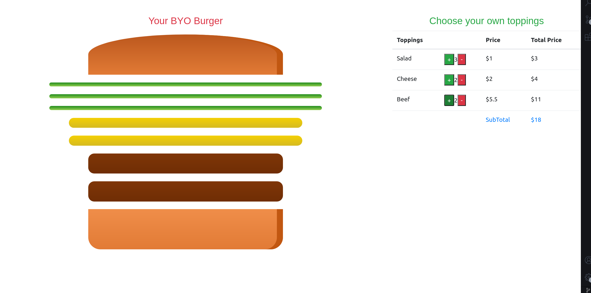

# Getting Started with Create React App

This project was bootstrapped with [Create React App](https://github.com/facebook/create-react-app).

## Project description

This project is to build your own burger. There are 3 types of toppings on the right side, salad, cheese and beef. When the user clicks on the buttons to change the quantity for each topping, the number of toppings will appear accordingly on the burger based on the amount of each topping. If the quantity is 0, there will be an alert to let the user knows the quantity is at least 0.

## Available Scripts

In the project directory, you can run:

### `yarn start`

Runs the app in the development mode.\
Open [http://localhost:3000](http://localhost:3000) to view it in the browser.

## Project view

